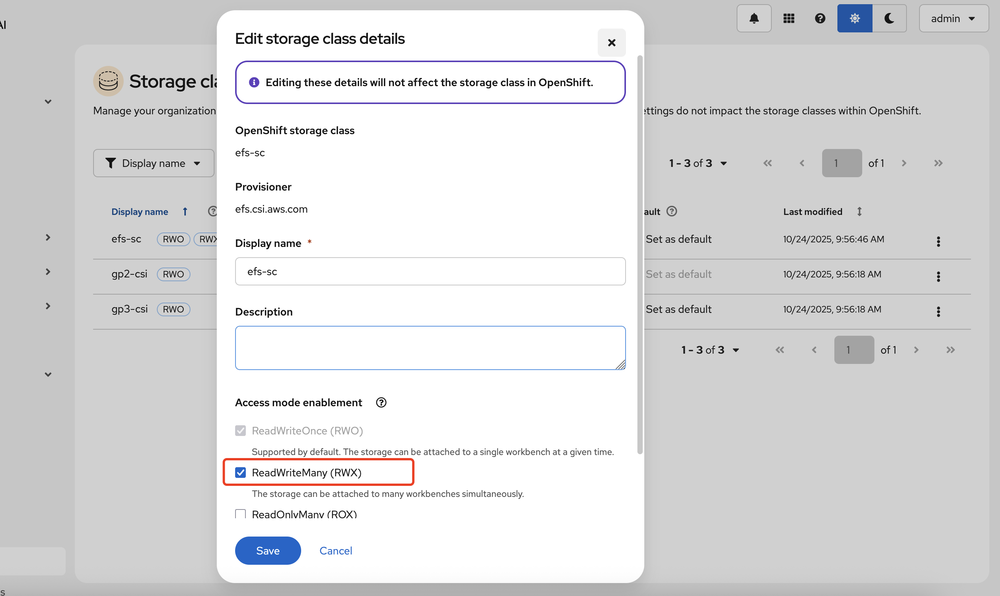
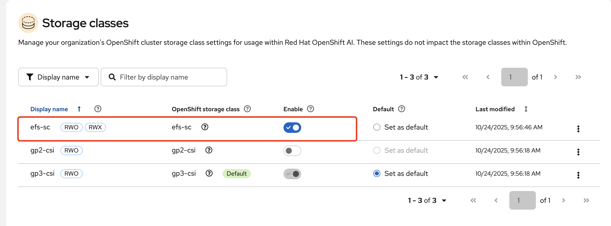

### Create efs storage class

- create file system from aws console

```
name: csi
same vpc of OpenShift: ocp-xyz-vpc
```

- get file system id and security groups of file system created

```
fs: fs-xyz
Security groups: sg-xyz
```

- edit security groups: sg-xyz

```
add inbound rules: nfs port, source range: 10.0.0.0/16(OpenShift vpc cidr)
add outbound rules: nfs port, source range: 10.0.0.0/16(OpenShift vpc cidr)
```

> for OpenShift with AWS **STS enabled only**
>
> ```
> wget https://mirror.openshift.com/pub/openshift-v4/clients/ocp/stable-4.18/ccoctl-linux-4.18.26.tar.gz
> 
> mkdir /home/rosa/credrequests
> ```
>
> ```
> vim /home/rosa/credrequests/openshift-cluster-csi-drivers-aws-efs-cloud-credentials-credentials.yaml	
> ```
>
> ```
> apiVersion: cloudcredential.openshift.io/v1
> kind: CredentialsRequest
> metadata:
>   name: openshift-aws-efs-csi-driver
>   namespace: openshift-cloud-credential-operator
> spec:
>   providerSpec:
>     apiVersion: cloudcredential.openshift.io/v1
>     kind: AWSProviderSpec
>     statementEntries:
>     - action:
>       - elasticfilesystem:*
>       effect: Allow
>       resource: '*'
>   secretRef:
>     name: aws-efs-cloud-credentials
>     namespace: openshift-cluster-csi-drivers
>   serviceAccountNames:
>   - aws-efs-csi-driver-operator
>   - aws-efs-csi-driver-controller-sa
> ```
>
> get oidc provider
>
> ```
> oc get authentication.config.openshift.io cluster -o json | jq -r .spec.serviceAccountIssuer
> ```
>
> ```
> ./ccoctl aws create-iam-roles --name=rhoai-yyds-aws-efs-csi-operator --region=us-east-2 --credentials-requests-dir=/home/rosa/credrequests  --identity-provider-arn=arn:aws:iam::<your id>:oidc-provider/oidc.op1.openshiftapps.com/xyz
> ```
>
> ouput will like below
>
> ```
> 2025/10/29 05:30:51 Role arn:aws:iam::<your id>:role/rhoai-yyds-aws-efs-csi-operator-openshift-cluster-csi-drivers-aw created
> 2025/10/29 05:30:51 Saved credentials configuration to: /home/rosa/manifests/openshift-cluster-csi-drivers-aws-efs-cloud-credentials-credentials.yaml
> 2025/10/29 05:30:51 Updated Role policy for Role rhoai-xyx-aws-efs-csi-operator-openshift-cluster-csi-drivers-aw
> ```
>
> role_arn = **arn:aws:iam::[your id]:role/rhoai-xyz-aws-efs-csi-operator-openshift-cluster-csi-drivers-aw**
>
> install **AWS EFS CSI Driver Operator** with arn **above**

- Create efs csi driver

```
apiVersion: operator.openshift.io/v1
kind: ClusterCSIDriver
metadata:
    name: efs.csi.aws.com
spec:
  managementState: Managed
```

- create storage class

```
kind: StorageClass
apiVersion: storage.k8s.io/v1
metadata:
  name: efs-sc
provisioner: efs.csi.aws.com
parameters:
  provisioningMode: efs-ap
  fileSystemId: fs-0e2174bef8c21c936
  directoryPerms: "700"
  gidRangeStart: "1000"
  gidRangeEnd: "2000"
  basePath: "/dynamic_provisioning"
```

### Test Storage Class

```
oc new-project efs-demo
```

```
cat <<EOF | oc apply -f -
apiVersion: v1
kind: PersistentVolumeClaim
metadata:
  name: pvc-efs-volume
spec:
  storageClassName: efs-sc
  accessModes:
    - ReadWriteMany
  resources:
    requests:
      storage: 5Gi
EOF
```

```
cat <<EOF | oc apply -f -
apiVersion: v1
kind: Pod
metadata:
 name: test-efs
spec:
 volumes:
   - name: efs-storage-vol
     persistentVolumeClaim:
       claimName: pvc-efs-volume
 containers:
   - name: test-efs
     image: centos:latest
     command: [ "/bin/bash", "-c", "--" ]
     args: [ "while true; do echo 'hello efs' | tee -a /mnt/efs-data/verify-efs && sleep 5; done;" ]
     volumeMounts:
       - mountPath: "/mnt/efs-data"
         name: efs-storage-vol
EOF
```

Clean up

```
oc delete project efs-demo 
```

### enable efs-sc for OpenShift AI





### Ref

https://cloud.redhat.com/experts/rosa/aws-efs/
https://access.redhat.com/articles/6849801
https://docs.redhat.com/en/documentation/openshift_container_platform/4.18/html/storage/using-container-storage-interface-csi#persistent-storage-csi-aws-efs
