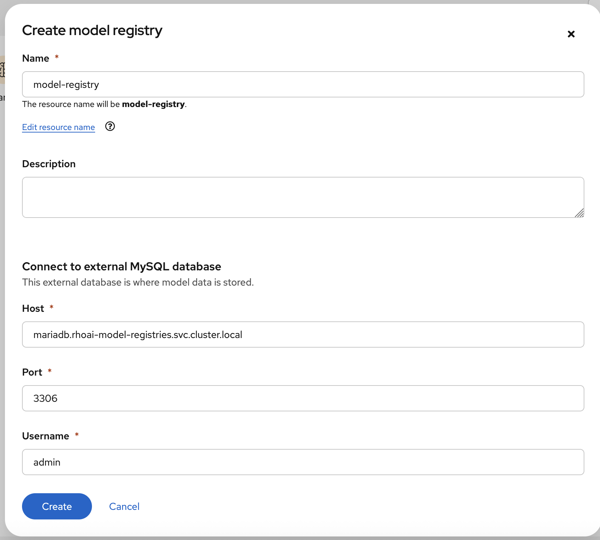
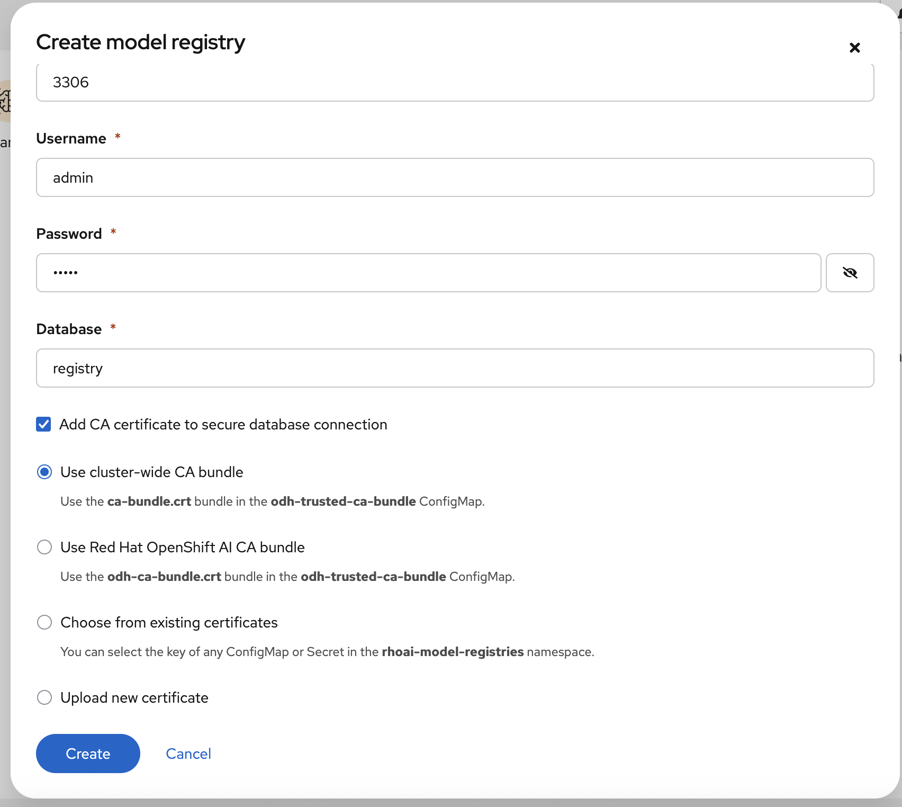
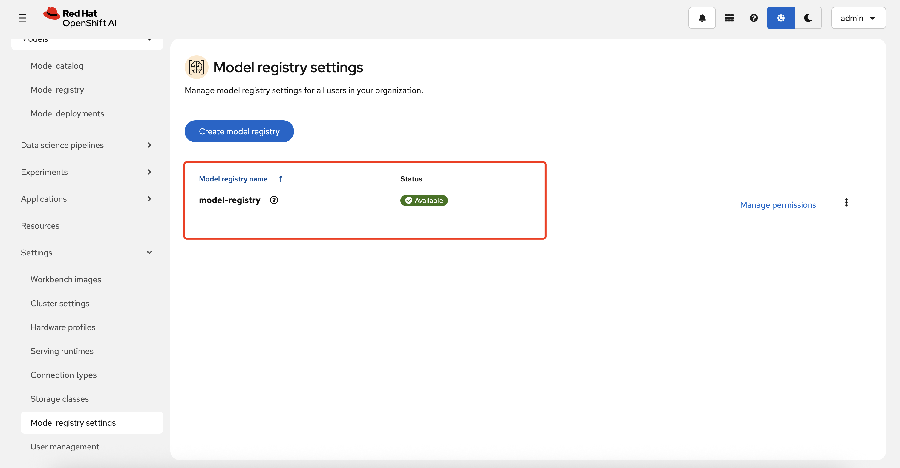

### Enable model registry

**Red Hat OpenShift AI Operator -> Data Science Cluster**

```
 modelregistry:
    managementState: Managed
    registriesNamespace: rhoai-model-registries
```

### Create MariaDB

```
oc apply -f mariadb.yaml
```

### Create model registry

**OpenShift AI dashboard -> Settings  -> Model registry settings**





